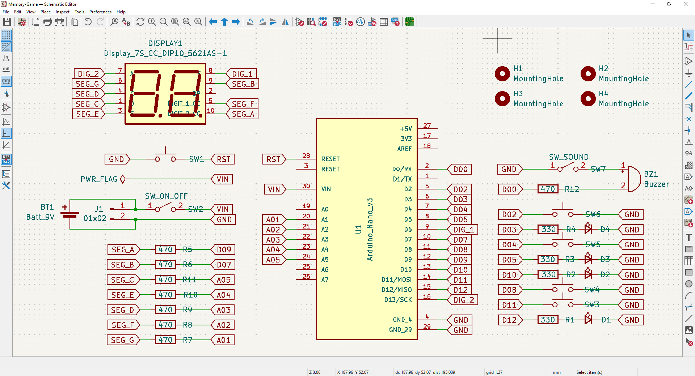
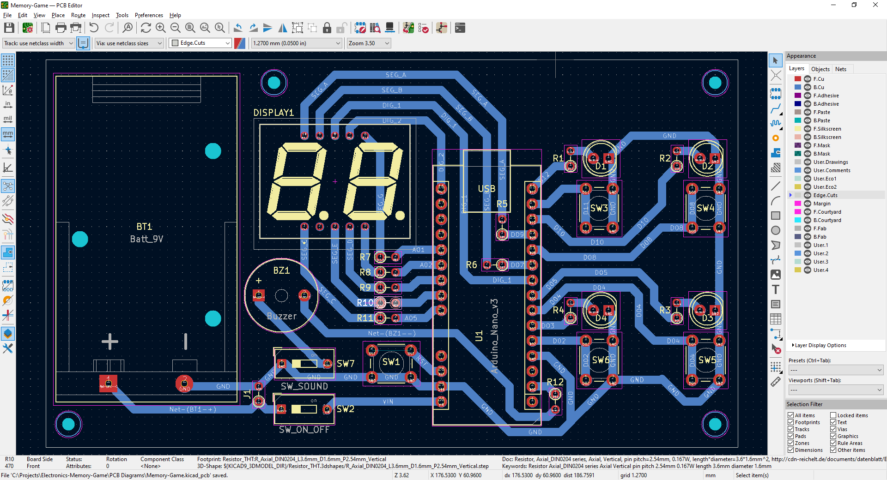
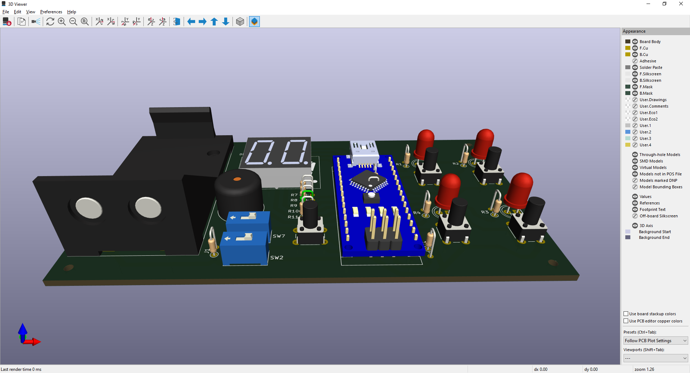
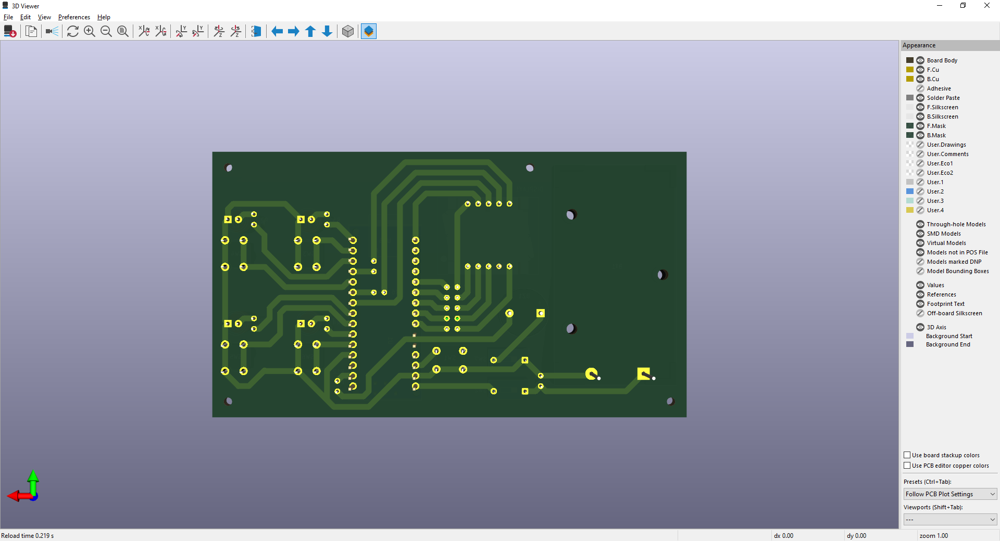

# Memory-Game

Arduino code for a 4 coloured memory game (Simon) 

&nbsp;

This project use the following electronic components:
- 1 x Arduino Nano v3
- 1 x Display 7-segments 2 digits (common catode)
- 4 x LEDs (red, blue, yellow & green)
- 1 x Buzzer
- 5 x Push-button
- 8 x 470 ohm resistors
- 4 x 330 ohm resistors
- 1 x Batery 9v

Please check `Definitions.h` and adjust configured display pins to your own display model.

&nbsp;

### Screenshots

| Schematic Diagram                              | PBC Layout                                     |
|------------------------------------------------|------------------------------------------------|
|      |             |

| PCB 3D Render                                  | PBC 3D Render                                  |
|------------------------------------------------|------------------------------------------------|
|          |          |

| Prototype                                      | Building                                       |
|------------------------------------------------|------------------------------------------------|
|              |               |

| Building                                       | Building (Finished)                            |
|------------------------------------------------|------------------------------------------------|
|               |      |

| Building (Finished)                            | Box Shaping                                    |
|------------------------------------------------|------------------------------------------------|
|      |               |

| Project Final                                  | Project Final (YouTube video)                  |
|------------------------------------------------|------------------------------------------------|
|          |  |

See 'Rescources' sub-folder for more pictures & videos of the project.

&nbsp;

### Version History

v1.0 (2023.03.08) - Initial release.  
v1.1 (2023.03.09) - Refactor for mudularity (adding concept of micro-commands for user inteccions).  
v1.2 (2023.03.10) - Improved animations.  
v1.3 (2023.03.15) - Pinout rearrange for easy soldering.  
v1.4 (2023.03.18) - Adding game finished sequence.  
v1.5 (2025.12.20) - Update project structure.  
v1.6 (2025.12.26) - Adding KiCAD 9 schematics and PCB diagrams.  

&nbsp;

This source code is licensed under GPL v3.0  
Please send me your feedback about this project: andres.garcia.alves@gmail.com
